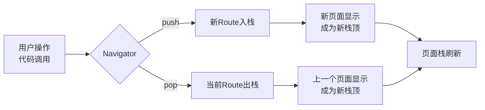

路由管理 多页面应用管理



- 基本路由

  - 实用场景：页面比较少，跳转简单
  - `MaterialApp` 是路由系统的组件只能存在一个。
  - 无需提前注册路由，跳转时创建 `MaterialPageRoute` 实例即可
  - 跳转新页面：`Navigator.push(BuildContext,Route route)`
  - 返回上一页：`Navigator.pop(BuildContext,Route route)`
  - ```dart
    //在ListWidget中
    onTap: () {
      Navigator.push(context, MaterialPageRoute(builder: (context)=>DetailWidget()));
    },
    //在DetailWidget中
    child: TextButton(onPressed: (){
      Navigator.pop(context);
    }, child: Text("返回上一页")),
    ```

- 命名路由

  - 实用场景：页面繁多，需要命名路由增加代码可维护性
  - 需要现在 `MaterialApp` 中注册一个路由表并设置 `initialRoute` （首页）
  - ```dart
    //在MainPage中
    Widget build(BuildContext context) {
      return MaterialApp(
        initialRoute: "/list",
        routes: {
          "/list":(context)=>ListWidget(),
          "/detail":(context)=>DetailWidget(),
        },
        home: ListWidget(),
      );
    }
    //在ListWidget中
    onTap: () {
      Navigator.pushNamed(context, "/detail");
    },
    //在DetailWidget中
    child: TextButton(onPressed: (){
      Navigator.pop(context);
    }, child: Text("返回上一页")),
    ```
  
- 基础路由传参

  - 类似于组件通信父传子，不再展示重复代码。

- 命名路由传参

  - 传参实现组件间相互通信
  - 传递参数：`Navigator.pushName(context, routeUrl,arguments:{参数})`
  - 接收参数：`ModalRoute.of(context)?.setting.arguments`
  - 接收时机：`initState` 获取不到路由参数直接报错，应放在`Future.microtask()` 异步微任务中
  - ```dart
    //在ListWidget中
    onTap: () {
      Navigator.pushNamed(context, "/detail",arguments: {"id":index+1});
    },
    //在_DetailWidgetState中
    Map<String, dynamic> _data = {};
    void initState() {
      super.initState();
      // ModalRoute.of(context);//直接使用也会直接报错
      Future.microtask((){
        if(ModalRoute.of(context)!=null){
          _data = ModalRoute.of(context)!.settings.arguments as Map<String, dynamic>;
          setState(() {});
        }
      });
    }
    ```

- 动态路由以及高级控制

  - `onGenerateRoute`：允许根据 `RouteSettings` （包含路由名称和参数）动态创建不同的 `Route`。
  - `onUnknownRoute` ：当找不到路由名称时，跳转 `Route` ，也可以根据 `RouteSettings` 动态创建不同的 `Route`。
  - ```dart
    //在MainPage中
    return MaterialApp(
      initialRoute: "/goodsList",
      routes: {
        "/goodsList":(context) => GoodsList(),
      },
      onGenerateRoute: (settings) {
        if(settings.name == "/CartList"){
          bool isLogin = true;
          if(isLogin){
            return MaterialPageRoute(builder: (context)=>CartList());
          }else{
            return MaterialPageRoute(builder: (context)=>LoginPage());
          }
        }
      },
      onUnknownRoute: (settings) => MaterialPageRoute(builder: (context)=>Page404()),
    );
    ```

    

  ```mermaid
  flowchart TD
   id1[路由请求]-->id2{路由名称是否<br/>在route表中}
   id2--是-->c1[直接使用表中对应的<br/>widgetBuilder构建页面]-->id3[完成路由构建]
   id2--否-->c2{是否在onGenerateRoute<br/>中处理了该名称}
   c2--是-->c3[调用onGenerateRoute中<br/>自定义逻辑构建页面]-->id3
   c2--否-->c4[触发onUnknownRoute<br>（通常是404页面）]-->id3
   
  ```

  

- 因为过多的路由也会导致过度的重复代码导致可读性降低，建议打包，构建路由框架。

- 然后Flutter原生不支持路径参数，可以使用第三方库go_router实现。

